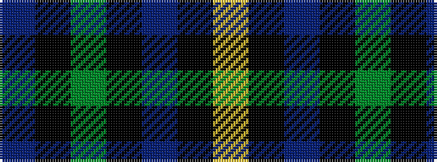

BKGKBKY

It is a 7 stripe tartan.

<figure class="pat-woven">

<figcaption>idealised sample</figcaption>
</figure>

## Colour Sequence



## Tartans with this colour sequence

| Tartans |
|---------------|
| [Murray of Elibank](/setts/s7/b64k3g14k4b4k12lo4~x2/)|
||
