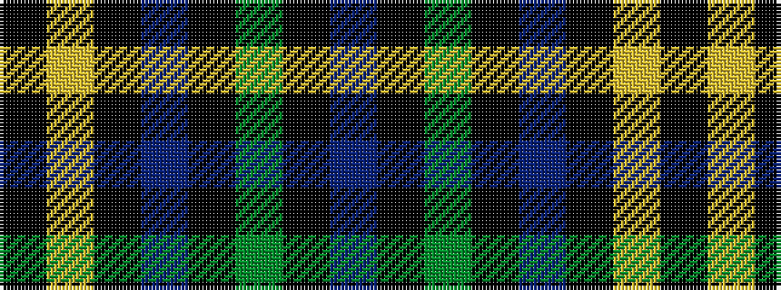

BKGKBKYK

It is a 8 stripe tartan.

<figure class="pat-woven">

<figcaption>idealised sample</figcaption>
</figure>

## Colour Sequence



## Tartans with this colour sequence

| Tartans |
|---------------|
| [Hope-Weir / Weir](/variants/s8/k8ly1k1db28k12g2k1t2~x2/)|
||
| [Hope-Weir/Weir](/variants/s8/k8ly1k1db28k12dg2k1t2~x2/)|
||
