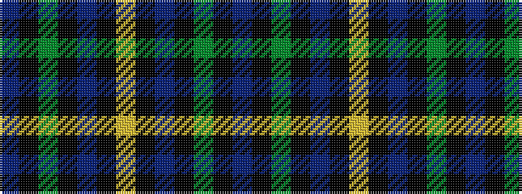

BKGKBKYKBKGKB

It is a 13 stripe tartan.

<figure class="pat-woven">

<figcaption>idealised sample</figcaption>
</figure>

## Colour Sequence



## Tartans with this colour sequence

| Tartans |
|---------------|
| [Murray of Elibank](/setts/s13/db56k6g24k6db8k21ly6k21db8k6g24k6db56/)|
||
