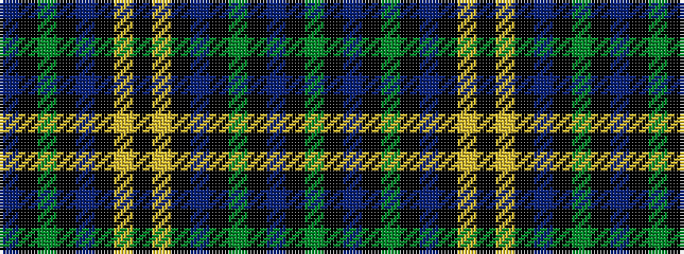

BKGKBKYKYKBKGKBKG

It is a 17 stripe tartan.

<figure class="pat-woven">

<figcaption>idealised sample</figcaption>
</figure>

## Colour Sequence



## Tartans with this colour sequence

| Tartans |
|---------------|
| [Hope-Vere/Weir](/variants/s17/g18k1db3k1g3k8db18k1ly1k5ly1k1db18k8g2k1db2~x2/)|
||
| [Weir (Clan)](/variants/s17/dg18k1b3k1dg3k8db18k1ly1k5ly1k1db18k8dg2k1b2~x2/)|
||
