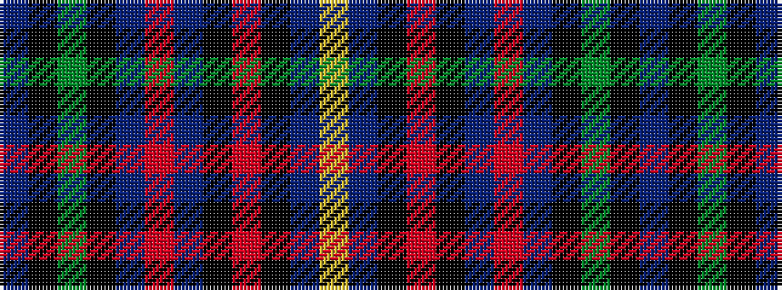

BKGKBRBKRKBY

It is a 12 stripe tartan.

<figure class="pat-woven">

<figcaption>idealised sample</figcaption>
</figure>

## Colour Sequence



## Tartans with this colour sequence

| Tartans |
|---------------|
| [Child, The](/variants/s12/p10k1dg4k1p10ri4p10k1r4k1p10lo4~x2/)|
||
