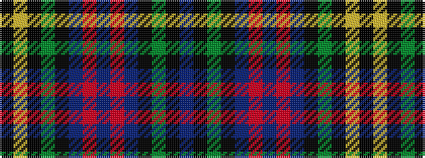

BKGKBRBRBKGKYK

It is a 14 stripe tartan.

<figure class="pat-woven">

<figcaption>idealised sample</figcaption>
</figure>

## Colour Sequence



## Tartans with this colour sequence

| Tartans |
|---------------|
| [Malcolm](/variants/s14/k1ly1k1g6k6db6r1db1r1db6k6g6k1b1~x4/)|
||
| [Malcolm](/variants/s14/k1ly1k1g6k6db6r1db1r1db6k6g6k1t1~x4/)|
||
| [Malcolm #2](/variants/s14/k1ly1k1dg6k6db6r1db1r1db6k6dg6k1t1~x4/)|
||
