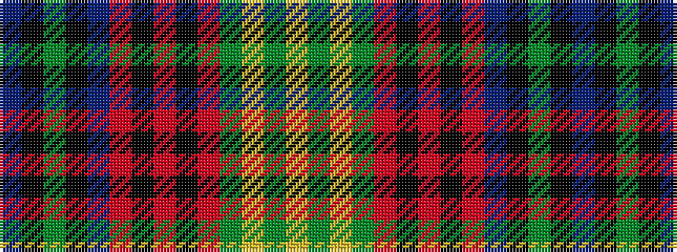

BKGKBRKRKRGYGY

It is a 14 stripe tartan.

<figure class="pat-woven">

<figcaption>idealised sample</figcaption>
</figure>

## Colour Sequence



## Tartans with this colour sequence

| Tartans |
|---------------|
| [Glynn of Glynnstewart (Personal)](/setts/s14/db20k2g3k2db20r3k20r2k20r3g30ly3g1ly2~x2/)|
||
| [Glynn of Glynstewart (Personal)](/setts/s14/t20k2g3k2t20r3k20r2k20r3g30ly3g1ly2~x2/)|
||
