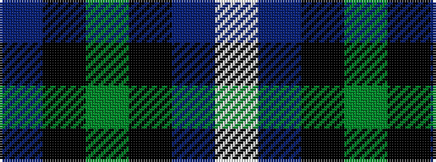

BKGKBW

It is a 6 stripe tartan.

<figure class="pat-woven">

<figcaption>idealised sample</figcaption>
</figure>

## Colour Sequence



## Tartans with this colour sequence

| Tartans |
|---------------|
| [Isle of Harris (District)](/setts/s6/t3k2g2k1db10w1~x8/)|
||
