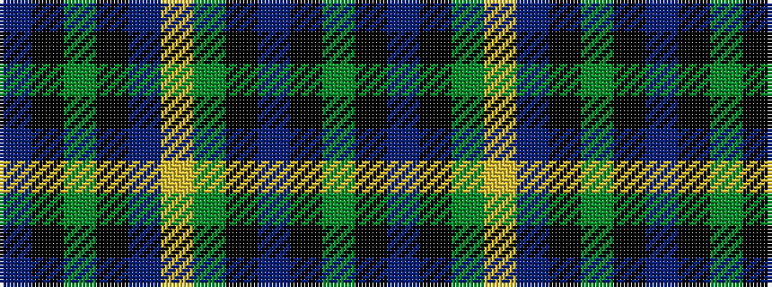

BKGKBYGKBKG

It is a 11 stripe tartan.

<figure class="pat-woven">

<figcaption>idealised sample</figcaption>
</figure>

## Colour Sequence



## Tartans with this colour sequence

| Tartans |
|---------------|
| [State Seal of South Carolina (Fash)](/variants/s11/gi55k13b4k3g6lo3b2k3dy10k12b14~x2/)|
||
