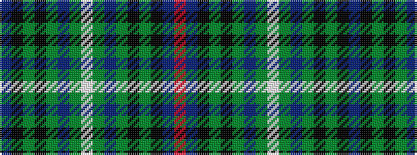

BKGKGBGWGBGKGKBR

It is a 16 stripe tartan.

<figure class="pat-woven">

<figcaption>idealised sample</figcaption>
</figure>

## Colour Sequence



## Tartans with this colour sequence

| Tartans |
|---------------|
| [Scottish Ambulance Service](/setts/s16/ti16k12g2k2dg32t2dg2lb3dg2t2dg32k2g2k12ti16r3~x2/)|
||
