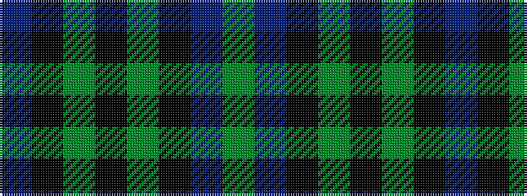

BKGKGKBG

It is a 8 stripe tartan.

<figure class="pat-woven">

<figcaption>idealised sample</figcaption>
</figure>

## Colour Sequence



## Tartans with this colour sequence

| Tartans |
|---------------|
| [Norwich No.064](/variants/s8/db12k16g14k5g14k16db12g4~x2/)|
||
