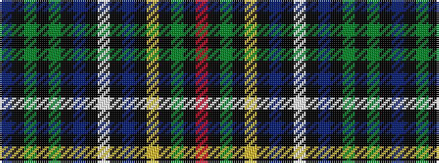

BKGKGKBKWKBKYKGKR

It is a 17 stripe tartan.

<figure class="pat-woven">

<figcaption>idealised sample</figcaption>
</figure>

## Colour Sequence



## Tartans with this colour sequence

| Tartans |
|---------------|
| [Cockburn](/variants/s17/db15k1g1k1g1k1db5k1w1k1db5k1ly1k1g5k1r1~x2/)|
||
| [Cockburn Blue](/variants/s17/db15k1dg1k1dg1k1db5k1w1k1db5k1ly1k1dg5k1r1~x2/)|
||
