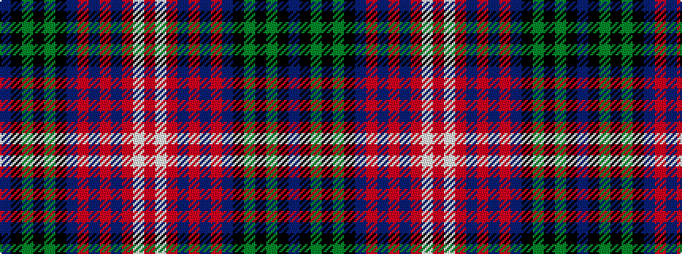

BKGKGKBRBRBRWR

It is a 14 stripe tartan.

<figure class="pat-woven">

<figcaption>idealised sample</figcaption>
</figure>

## Colour Sequence



## Tartans with this colour sequence

| Tartans |
|---------------|
| [Stewart Old](/variants/s14/db5k2g2k2g2k2db8r3db3r3db8r3w5r3~x2/)|
||
| [Stuart/Stewart Old](/variants/s14/db5k2dg2k2dg2k2db8r3db3r3db8r3w5r3~x2/)|
||
| [Wcwm 1138](/variants/s14/db14k2g3k2g3k2db12r4db10r3db10r4lb28r4~x2/)|
||
