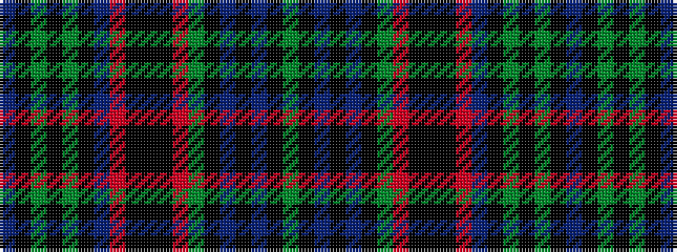

BKGKGKBRKKKRGKBKBKG

It is a 19 stripe tartan.

<figure class="pat-woven">

<figcaption>idealised sample</figcaption>
</figure>

## Colour Sequence



## Tartans with this colour sequence

| Tartans |
|---------------|
| [O'Connor / Ochiltree](/variants/s19/db12ki1g2ki1g2ki1db12r2ki12k1ki12r2g12ki1db2ki1db2ki1g12~x4/)|
||
