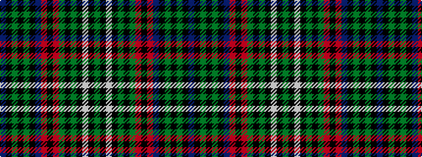

BKGKGKBRKRGKGKWKG

It is a 17 stripe tartan.

<figure class="pat-woven">

<figcaption>idealised sample</figcaption>
</figure>

## Colour Sequence



## Tartans with this colour sequence

This pattern is a design lineage: every tartan below shares one colour order, whatever its owner —
near-identical designs are grouped, the largest lineage first (#112: the pattern is a tartan's
second parent, beside its family or clan).

<table class="sett-table">
<tbody>
<tr><td><a href="/variants/s17/g20k2w2k2y2k2g19r5k19r5t20k2g2k2g2k2t20~x2/">MacNicol Htg (Clan)</a></td></tr>
<tr><td class="sett-swatch"></td></tr>
<tr><td><a href="/setts/db10k1g1k1g1k1db10r3k10r3g10k1y1k1w1k1g10/">MacNicol Hunting</a></td></tr>
<tr><td class="sett-swatch"></td></tr>
</tbody>
</table>

