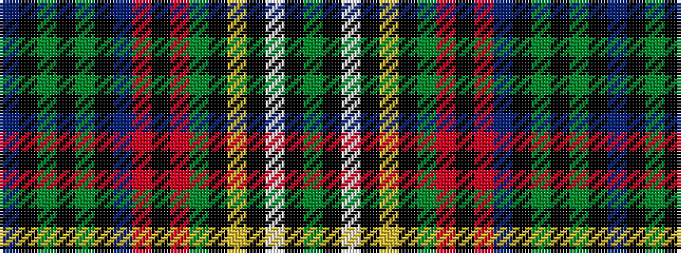

BKGKGKBRKRGKYKWKG

It is a 17 stripe tartan.

<figure class="pat-woven">

<figcaption>idealised sample</figcaption>
</figure>

## Colour Sequence



## Tartans with this colour sequence

| Tartans |
|---------------|
| [Cunningham Hunting](/variants/s17/db12k2g2k2g2k2db13r6k10r6g13k2lo2k2lb2k2g12~x2/)|
||
| [Cunningham, hunting](/variants/s17/db10k1g1k1g1k1db10r3k10r3g10k1ly1k1w1k1g10~x2/)|
||
| [MacNicol Htg (Clan)](/variants/s17/g20k2w2k2ly2k2g19r5k19r5b20k2g2k2g2k2b20~x2/)|
||
| [MacNicol Hunting](/variants/s17/dg10k1lb1k1ly1k1dg10r3k10r3db10k1dg1k1dg1k1db10/)|
||
| [Nicolson Green Hunting](/variants/s17/db12k1g1k1g1k1db9r2k18r2g9k1lo1k1lb1k1g12~x2/)|
||
