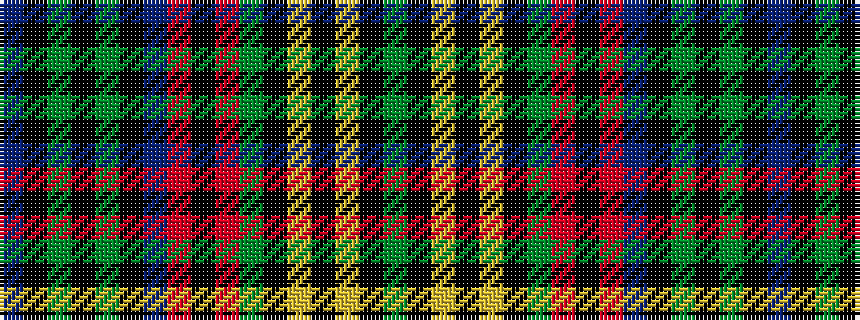

BKGKGKBRKRGKYKYKG

It is a 17 stripe tartan.

<figure class="pat-woven">

<figcaption>idealised sample</figcaption>
</figure>

## Colour Sequence



## Tartans with this colour sequence

| Tartans |
|---------------|
| [MacNicol Hunting](/setts/s17/dg10k1lr1k1ly1k1dg10r3k10r3db10k1dg1k1dg1k1db10~x2/)|
||
