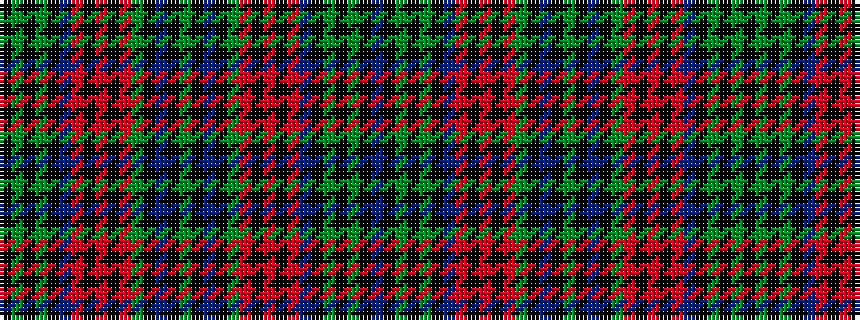

BKGKGKBRKRKRGKBKGKBKGRKRKRBKGKGK

It is a 32 stripe tartan.

<figure class="pat-woven">

<figcaption>idealised sample</figcaption>
</figure>

## Colour Sequence



## Tartans with this colour sequence

| Tartans |
|---------------|
| [Stewart of Bute](/setts/s32/g34k2b2k2g34r3k34r2k34r3b33k2g2k2g2k2b33~x2/)|
||
