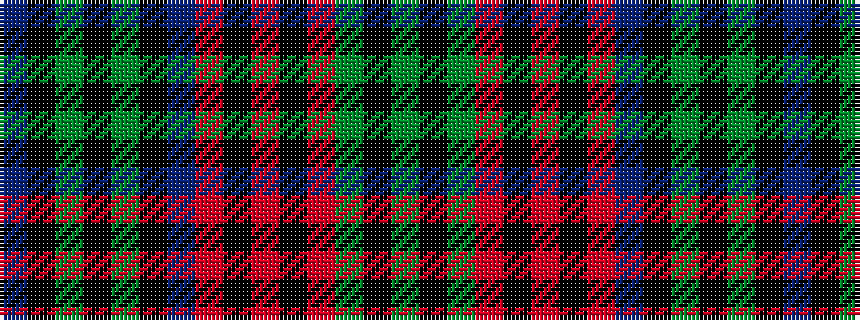

BKGKGKBRKRKRGKG

It is a 15 stripe tartan.

<figure class="pat-woven">

<figcaption>idealised sample</figcaption>
</figure>

## Colour Sequence



## Tartans with this colour sequence

| Tartans |
|---------------|
| [Earl of Dumfries (Personal)](/setts/s15/dg13k6dg13r3k10r2k10r3db13k2dg2k2dg2k2db13~x2/)|
||
