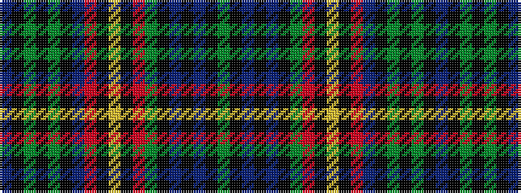

BKGKGKBRKYKRGKBKBKG

It is a 19 stripe tartan.

<figure class="pat-woven">

<figcaption>idealised sample</figcaption>
</figure>

## Colour Sequence



## Tartans with this colour sequence

| Tartans |
|---------------|
| [Ochiltree](/tartans/db12k1g2k1g2k1db12r2k12ly1k12r2g12k1db2k1db2k1g12/)|
||
