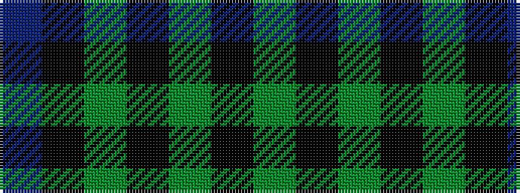

BKGKGKG

It is a 7 stripe tartan.

<figure class="pat-woven">

<figcaption>idealised sample</figcaption>
</figure>

## Colour Sequence



## Tartans with this colour sequence

| Tartans |
|---------------|
| [Ahmlaigh (Corporate)](/setts/s7/dp50k8g4k1g4k1g14/)|
||
