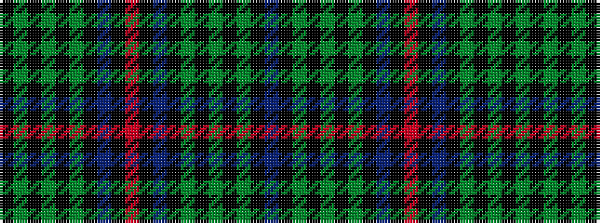

BKGKGKGKBKRKBKGKGKGK

It is a 20 stripe tartan.

<figure class="pat-woven">

<figcaption>idealised sample</figcaption>
</figure>

## Colour Sequence



## Tartans with this colour sequence

| Tartans |
|---------------|
| [Phillips of Wales](/variants/s20/k20dg30k2dg4k2dg30k3db30k35r2k35db30k3dg30k2dg4k2dg30k20dbi2/)|
||
