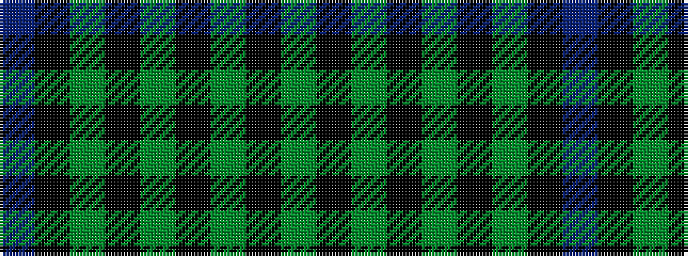

BKGKGKGKG

It is a 9 stripe tartan.

<figure class="pat-woven">

<figcaption>idealised sample</figcaption>
</figure>

## Colour Sequence



## Tartans with this colour sequence

| Tartans |
|---------------|
| [Menez Du](/setts/s9/db5k9g7k3g7k3g7k25g3~x2/)|
||
