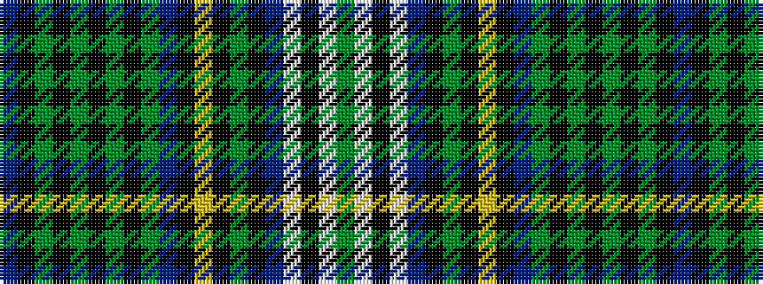

BKGKGKGKGBKYKGKBWKWG

It is a 20 stripe tartan.

<figure class="pat-woven">

<figcaption>idealised sample</figcaption>
</figure>

## Colour Sequence



## Tartans with this colour sequence

| Tartans |
|---------------|
| [Unidentified #18](/variants/s20/t3k3dy1k1dy1k1dy1k1dy3t2k1ly1k1dy1k2db2w7k1w2dy1~x2/)|
||
