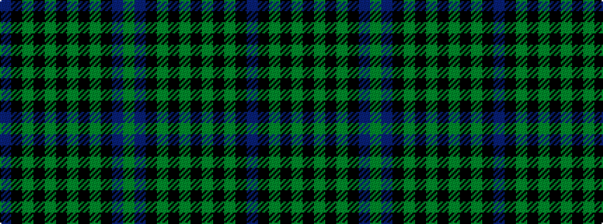

BKGKGKGKGKBG

It is a 12 stripe tartan.

<figure class="pat-woven">

<figcaption>idealised sample</figcaption>
</figure>

## Colour Sequence



## Tartans with this colour sequence

| Tartans |
|---------------|
| [Wilson's No.157 #2](/variants/s12/dp12k12dg12k2dg12k11dg12k2dg12k12dp12y3~x2/)|
||
