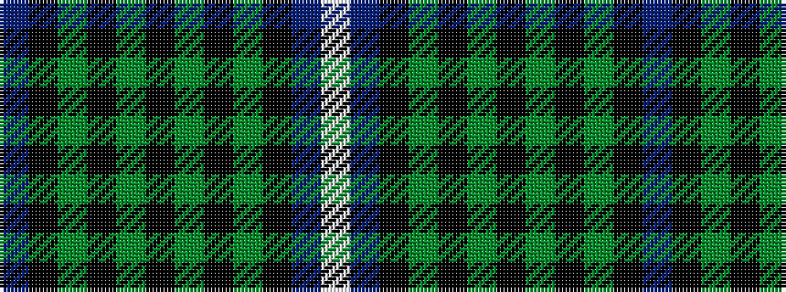

BKGKGKGKGKBW

It is a 12 stripe tartan.

<figure class="pat-woven">

<figcaption>idealised sample</figcaption>
</figure>

## Colour Sequence



## Tartans with this colour sequence

| Tartans |
|---------------|
| [Norwich No.031](/setts/s12/t8k8g8k1g8k8g8k1g8k8t8w2~x2/)|
||
