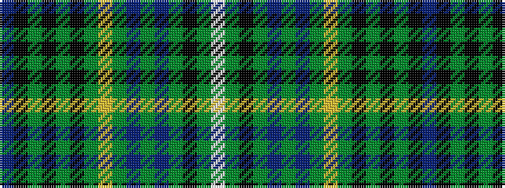

BKGKGKGYGBGBGKGW

It is a 16 stripe tartan.

<figure class="pat-woven">

<figcaption>idealised sample</figcaption>
</figure>

## Colour Sequence



## Tartans with this colour sequence

| Tartans |
|---------------|
| [Innes Hunting Clan Tartan](/variants/s16/t3k18dy3k4dy3k3dy18ly3dy3db8dy3db3g15k3dy3w3~x2/)|
||
| [Innes of Learney Htg (Personal)](/variants/s16/t3k18dy3k3dy3k3dy18lo3dy3db8dy3db3g15k3dy3w3~x2/)|
||
