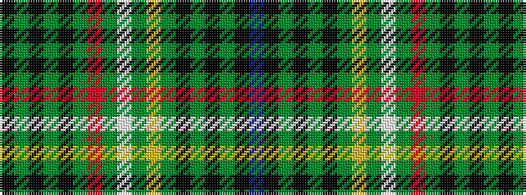

BKGKGKGYGWGRGKGKGK

It is a 18 stripe tartan.

<figure class="pat-woven">

<figcaption>idealised sample</figcaption>
</figure>

## Colour Sequence



## Tartans with this colour sequence

| Tartans |
|---------------|
| [Campbell, Marquis of Lorne](/setts/s18/k6g4k22g3k3g32r3g3w3g3ly3g32k3g3k22g4k6dp6/)|
||
| [Campbell, Marquis of Lorne](/setts/s18/k6g4k22g3k3g32r3g3w3g3ly3g32k3g3k22g4k6p6/)|
||
