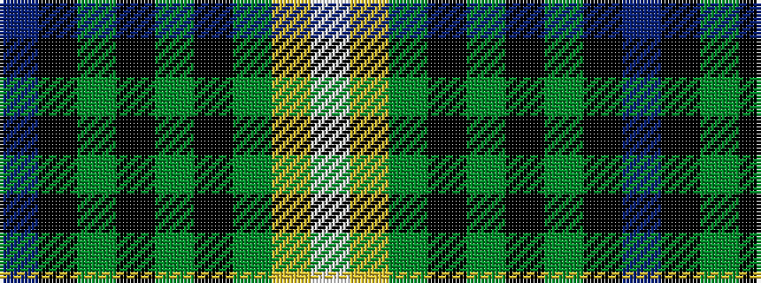

BKGKGKGYW

It is a 9 stripe tartan.

<figure class="pat-woven">

<figcaption>idealised sample</figcaption>
</figure>

## Colour Sequence



## Tartans with this colour sequence

| Tartans |
|---------------|
| [Hutchens (Kansas) (Personal)](/setts/s9/db10k12g3k1g1k1g30lo4w4~x2/)|
||
