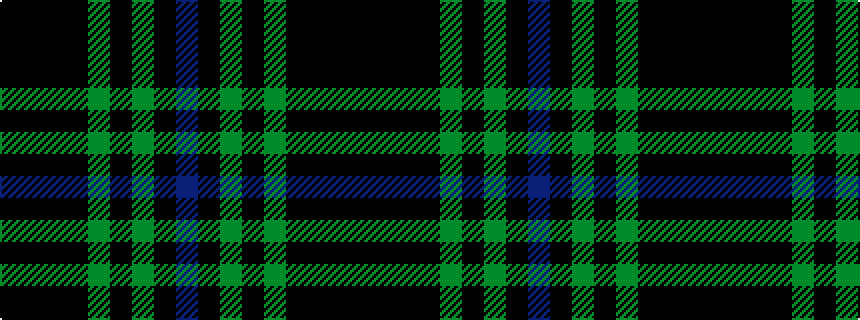

BKGKGKKKK

It is a 9 stripe tartan.

<figure class="pat-woven">

<figcaption>idealised sample</figcaption>
</figure>

## Colour Sequence



## Tartans with this colour sequence

| Tartans |
|---------------|
| [Orman (Personal)](/variants/s9/ki10k3ki3k32dg1k1dg1k2n2~x2/)|
||
