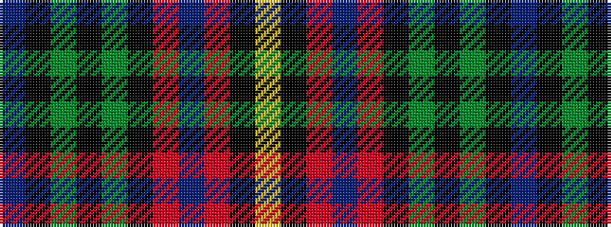

BKGKGKRBRKY

It is a 11 stripe tartan.

<figure class="pat-woven">

<figcaption>idealised sample</figcaption>
</figure>

## Colour Sequence



## Tartans with this colour sequence

| Tartans |
|---------------|
| [Porsche Bank Austria](/setts/s11/db49k2g2k2g2k10r38db5r4k4lr10~x2/)|
||
