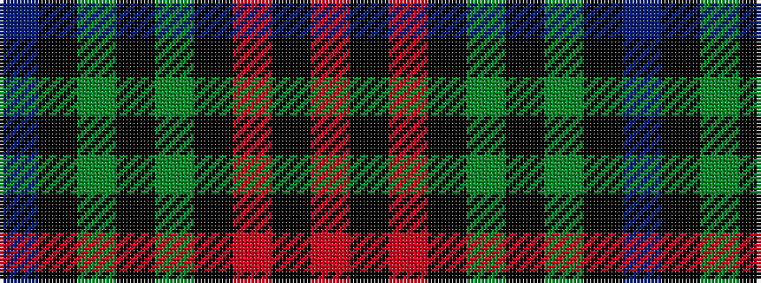

BKGKGKRKR

It is a 9 stripe tartan.

<figure class="pat-woven">

<figcaption>idealised sample</figcaption>
</figure>

## Colour Sequence



## Tartans with this colour sequence

| Tartans |
|---------------|
| [Black Thistle](/setts/s9/b10k6g42k2g1k2r1k24r2~x2/)|
||
