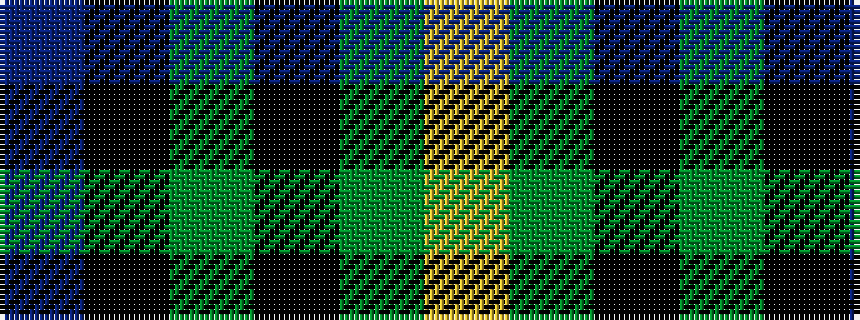

BKGKGY

It is a 6 stripe tartan.

<figure class="pat-woven">

<figcaption>idealised sample</figcaption>
</figure>

## Colour Sequence



## Tartans with this colour sequence

| Tartans |
|---------------|
| [Leahy (Australia) (Personal)](/setts/s6/db2k6g2k6g12ly1~x4/)|
||
| [Leahy, Thomas Francis & Mary (Australia)](/setts/s6/db2k6g2k6dg12ly1~x4/)|
||
