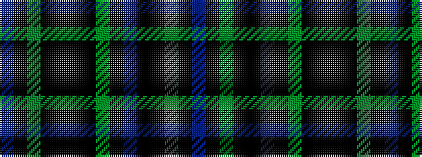

BKGKKBKGKKKKGKB

It is a 15 stripe tartan.

<figure class="pat-woven">

<figcaption>idealised sample</figcaption>
</figure>

## Colour Sequence



## Tartans with this colour sequence

| Tartans |
|---------------|
| [Letham Hunting](/setts/s15/dp2k1dg6k4k1k5k2dg30k2db4k1k4dg6k1dp2~x2/)|
||
