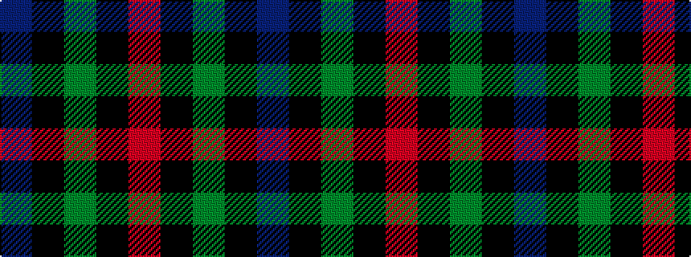

BKGKR

It is a 5 stripe tartan.

<figure class="pat-woven">

<figcaption>idealised sample</figcaption>
</figure>

## Colour Sequence



## Tartans with this colour sequence

| Tartans |
|---------------|
| [Clark](/setts/r3k1dg1k1b3/)|
||
| [Clark Clerk(e)](/variants/s5/db3k1dg1k1m3~x16/)|
||
