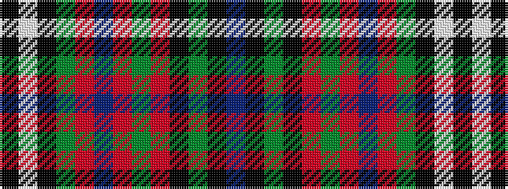

BKGKRGRBRGKWK

It is a 13 stripe tartan.

<figure class="pat-woven">

<figcaption>idealised sample</figcaption>
</figure>

## Colour Sequence



## Tartans with this colour sequence

| Tartans |
|---------------|
| [Clifford](/setts/s13/dt10k3g3k8m9g3m10b3m28g3k3w3k3~x2/)|
||
