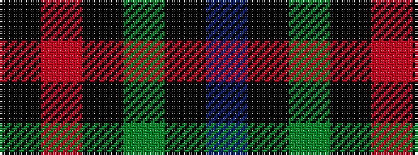

BKGKRK

It is a 6 stripe tartan.

<figure class="pat-woven">

<figcaption>idealised sample</figcaption>
</figure>

## Colour Sequence



## Tartans with this colour sequence

| Tartans |
|---------------|
| [Clerk](/variants/s6/db5k1dg1k1r3k1~x4/)|
||
| [Clerk](/variants/s6/db5k1g1k1r3k1~x4/)|
||
