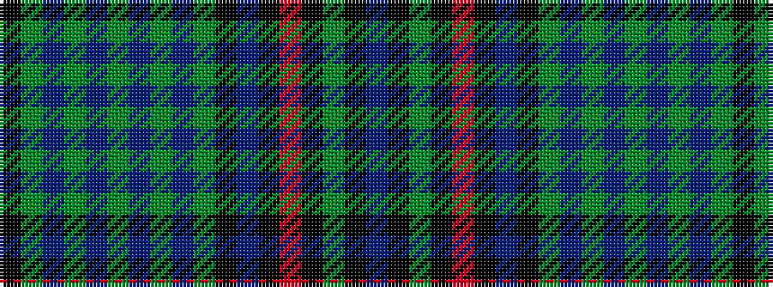

BKGKRKBKGBGBGBGBGK

It is a 18 stripe tartan.

<figure class="pat-woven">

<figcaption>idealised sample</figcaption>
</figure>

## Colour Sequence



## Tartans with this colour sequence

| Tartans |
|---------------|
| [Quraysh](/variants/s18/dt8k50y2k2o2k24dt8k2y2n1y2n8y2n8y2n1y2k2~x2/)|
||
