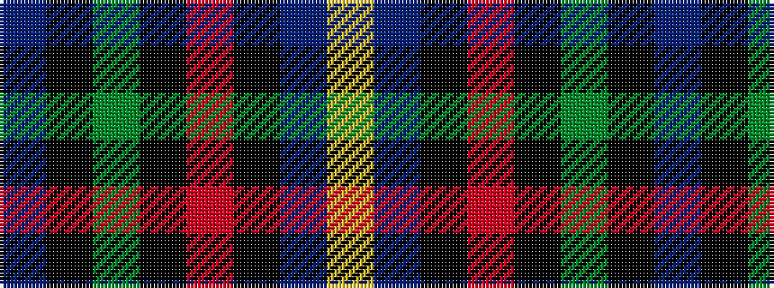

BKGKRKBY

It is a 8 stripe tartan.

<figure class="pat-woven">

<figcaption>idealised sample</figcaption>
</figure>

## Colour Sequence



## Tartans with this colour sequence

| Tartans |
|---------------|
| [Kilgour (Symmetrical)](/setts/s8/db6k3g14k3r14k3db6ly1~x4/)|
||
