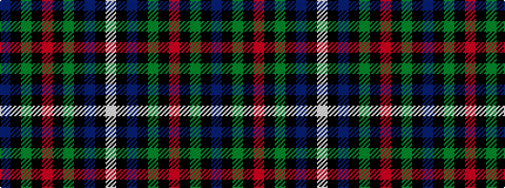

BKGKRKGKBKW

It is a 11 stripe tartan.

<figure class="pat-woven">

<figcaption>idealised sample</figcaption>
</figure>

## Colour Sequence



## Tartans with this colour sequence

| Tartans |
|---------------|
| [Robertson, hunting](/variants/s11/db28k12g16k1r2k1g16k12db12k1w3~x2/)|
||
