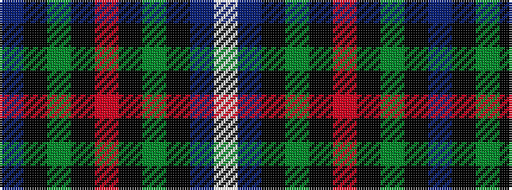

BKGKRKGKBW

It is a 10 stripe tartan.

<figure class="pat-woven">

<figcaption>idealised sample</figcaption>
</figure>

## Colour Sequence



## Tartans with this colour sequence

| Tartans |
|---------------|
| [Robertson Hunting #2](/setts/s10/db18k10dg9k2r2k2dg9k10db9w2~x2/)|
||
| [Robertson, hunting](/setts/s10/db18k10g9k2r2k2g9k10db9w2~x2/)|
||
