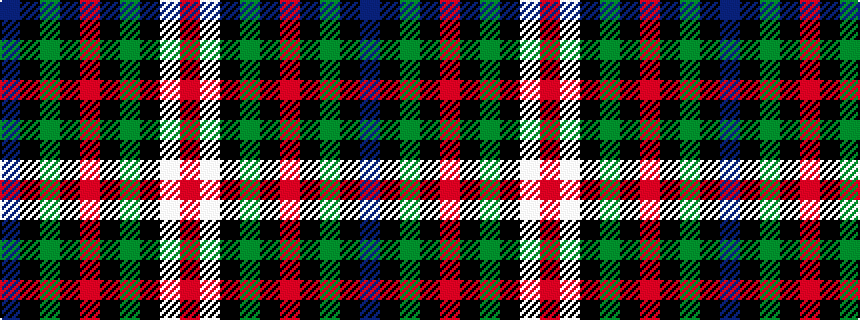

BKGKRKGKWR

It is a 10 stripe tartan.

<figure class="pat-woven">

<figcaption>idealised sample</figcaption>
</figure>

## Colour Sequence



## Tartans with this colour sequence

| Tartans |
|---------------|
| [Border Union Cattle Show](/variants/s10/dr20k4g14k1o2k1g14k10w22o7~x2/)|
||
