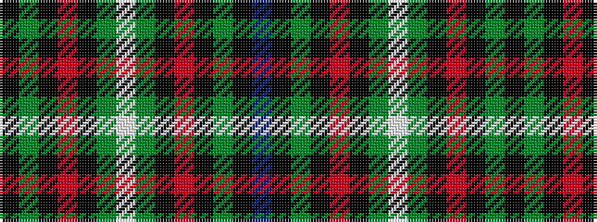

BKGKRKGWGKRKGK

It is a 14 stripe tartan.

<figure class="pat-woven">

<figcaption>idealised sample</figcaption>
</figure>

## Colour Sequence



## Tartans with this colour sequence

| Tartans |
|---------------|
| [Lambert Dark (Personal)](/setts/s14/k34g10k5r2k8dy2w3dy2k8r2k5g10k28b3~x2/)|
||
