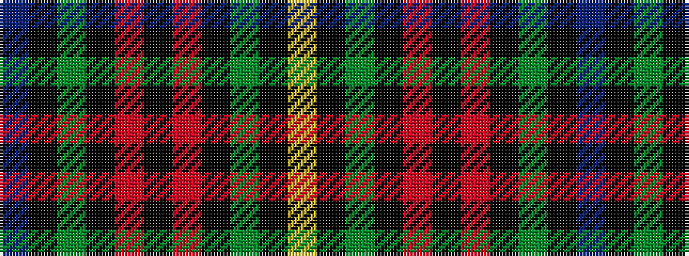

BKGKRKRKGKY

It is a 11 stripe tartan.

<figure class="pat-woven">

<figcaption>idealised sample</figcaption>
</figure>

## Colour Sequence



## Tartans with this colour sequence

| Tartans |
|---------------|
| [Unidentified #12](/setts/s11/t2k1dg36k1r2k1r2k1dg36k1ly2~x2/)|
||
| [Unidentified 23](/setts/s11/t2k1g36k1r2k1r2k1g36k1ly2~x2/)|
||
