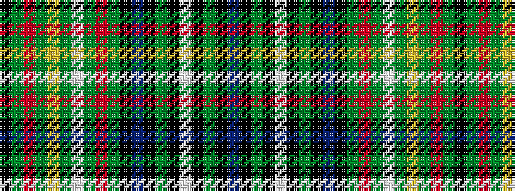

BKGKWKGKBKGRGWGYGRGK

It is a 20 stripe tartan.

<figure class="pat-woven">

<figcaption>idealised sample</figcaption>
</figure>

## Colour Sequence



## Tartans with this colour sequence

| Tartans |
|---------------|
| [Unidentified Phyllis Gordon](/variants/s20/k40dg8r1dg57ly5dg9w5dg57r1dg8k40dp7k4dg4k2w4k2dg4k4dp7~x2/)|
||
| [Unidentified, Phyllis Gordon](/variants/s20/k40g8r1g57ly5g9w5g57r1g8k40dp7k4g4k2w4k2g4k4dp7~x2/)|
||
