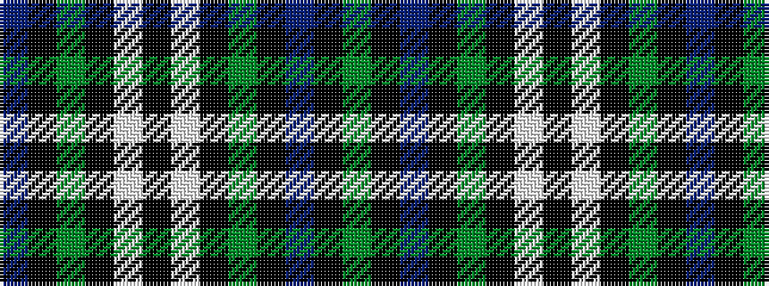

BKGKWKWKGKBKG

It is a 13 stripe tartan.

<figure class="pat-woven">

<figcaption>idealised sample</figcaption>
</figure>

## Colour Sequence



## Tartans with this colour sequence

| Tartans |
|---------------|
| [Stephenson Hunting](/setts/s13/db9k9dg9k1w1k2w1k1dg9k9db9k1dg2~x4/)|
||
| [Stephenson, hunting](/setts/s13/db9k9g9k1w1k2w1k1g9k9db9k1g2~x4/)|
||
