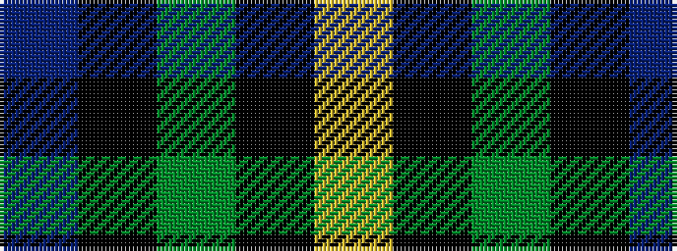

BKGKY

It is a 5 stripe tartan.

<figure class="pat-woven">

<figcaption>idealised sample</figcaption>
</figure>

## Colour Sequence



## Tartans with this colour sequence

| Tartans |
|---------------|
| [Rothesay & Caithness Fencibles (Mil)](/variants/s5/b32k10g15k2ly4~x2/)|
||
