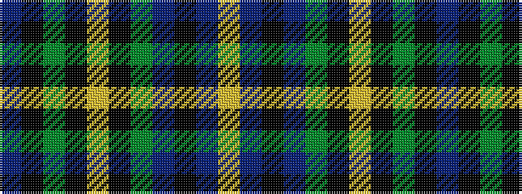

BKGKYKGBKBY

It is a 11 stripe tartan.

<figure class="pat-woven">

<figcaption>idealised sample</figcaption>
</figure>

## Colour Sequence



## Tartans with this colour sequence

| Tartans |
|---------------|
| [Skye](/setts/s11/db45k10y2k2ly2k2y10db5k1db5ly1~x2/)|
||
