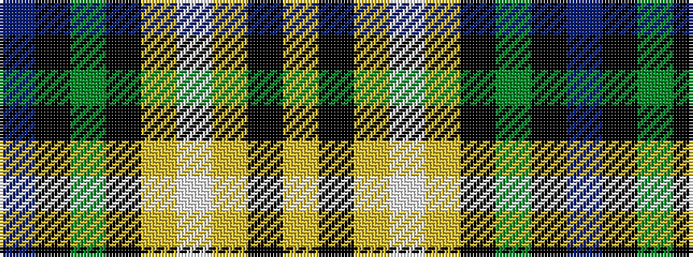

BKGKYWYKY

It is a 9 stripe tartan.

<figure class="pat-woven">

<figcaption>idealised sample</figcaption>
</figure>

## Colour Sequence



## Tartans with this colour sequence

| Tartans |
|---------------|
| [O'Rourke (Estimated threadcount)](/setts/s9/t25k1dy6k1lr10w3lr10k1ly3~x4/)|
||
