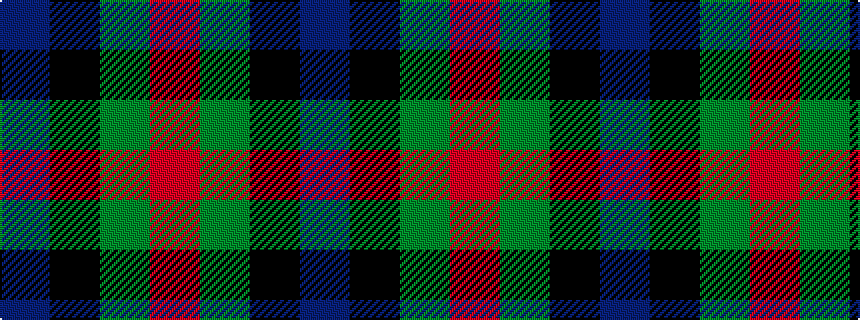

BKGR

It is a 4 stripe tartan.

<figure class="pat-woven">

<figcaption>idealised sample</figcaption>
</figure>

## Colour Sequence



## Tartans with this colour sequence

This pattern is a design lineage: every tartan below shares one colour order, whatever its owner —
near-identical designs are grouped, the largest lineage first (#112: the pattern is a tartan's
second parent, beside its family or clan).

<table class="sett-table">
<tbody>
<tr><td><a href="/tartans/g/gu/gunn-2/">Gunn</a></td></tr>
<tr><td class="sett-swatch"></td></tr>
<tr><td><a href="/tartans/n/no/norwich-collection-no-60/">Norwich Collection No. 60</a></td></tr>
<tr><td class="sett-swatch"></td></tr>
<tr><td><a href="/tartans/u/un/unidentified-no-60/">Unidentified No 60</a></td></tr>
<tr><td class="sett-swatch"></td></tr>
<tr><td><a href="/tartans/u/un/unidentified-pattern-2/">Unidentified pattern</a></td></tr>
<tr><td class="sett-swatch"></td></tr>
<tr class="cluster-sep"><td></td></tr>
<tr><td><a href="/tartans/b/bo/bowater/">Bowater</a></td></tr>
<tr><td class="sett-swatch"></td></tr>
</tbody>
</table>

